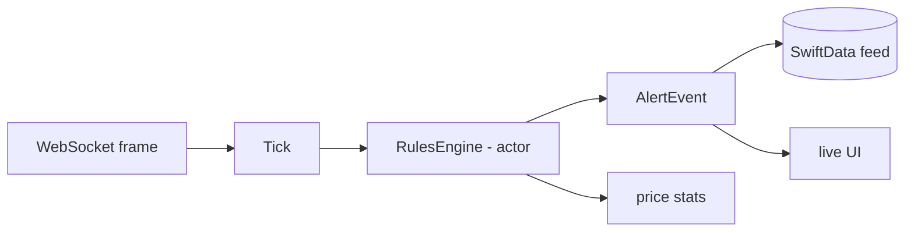

# DriftWatch

Live price alerts for crypto. You set a rule like "BTC above 70000" and the app
watches the market over a WebSocket feed and fires the moment the price crosses
your line. No backend, no API key: it connects straight to the Binance public
market-data stream.

> Status: early development. The core (WebSocket transport, rules engine) is the
> focus; secondary screens may be mocked while the main feature is built out.
> Diploma project for the OTUS iOS Developer Professional course.

## Why it exists

Most "realtime" price apps actually poll a REST endpoint every few seconds, so
they miss the exact tick that crosses a threshold. DriftWatch listens to the live
trade stream instead, matches rules locally as ticks arrive, and shows a feed of
what fired. The interesting part is keeping that stream reliable: reconnect after
a drop, resync the last price, and never fire a duplicate or a stale alert.

## How it works



<details>
<summary>Same flow as plain text</summary>

```
WebSocket frame -> Tick -> RulesEngine (actor) -> AlertEvent
                              -> price stats
AlertEvent -> SwiftData feed + live UI
```
</details>

- Prices arrive over the Binance combined trade stream.
- An `actor` holds all live rule state, so there is no data race by construction.
- After a reconnect the engine resyncs the last price over REST, and a live tick
  always wins over a stale resync (this is the part that needs care).
- Fired alerts go to a local feed and to the screen at the same time.

## Stack

- iOS 18, Swift 6 with strict concurrency
- SwiftUI, `@Observable`
- Swift Concurrency: actors, `AsyncStream`, structured concurrency
- SwiftData for the local feed
- Swift Package Manager for the module split
- Swift Testing for unit tests

## Run it

Requires Xcode 26 or newer.

```
git clone <repo-url>
cd DriftWatch
open DriftWatch.xcodeproj
```

Pick an iPhone simulator and run. The app target is still a stub while the core
is built out in the package; to see the working parts today, run the tests:

```
cd DriftWatchKit
swift test
```

The target stays the same: no API key or account, the app will talk to the
public Binance stream out of the box, and a fake transport with scripted ticks
will drive it when the live stream is blocked.

## Architecture notes

The domain logic lives in a local Swift package so the compiler enforces the
layer boundaries: the domain cannot import SwiftUI or networking because it does
not depend on them. Transport sits behind a protocol with two implementations,
a live Binance one and a fake one for tests.

## Roadmap

- [ ] WebSocket transport with reconnect, backoff and heartbeat
- [ ] Rules engine with threshold and percent-move rules
- [ ] Local feed with dedup and paging
- [ ] Live chart
- [ ] On-device anomaly detector (rolling z-score)

## License

MIT. See [LICENSE](LICENSE).
