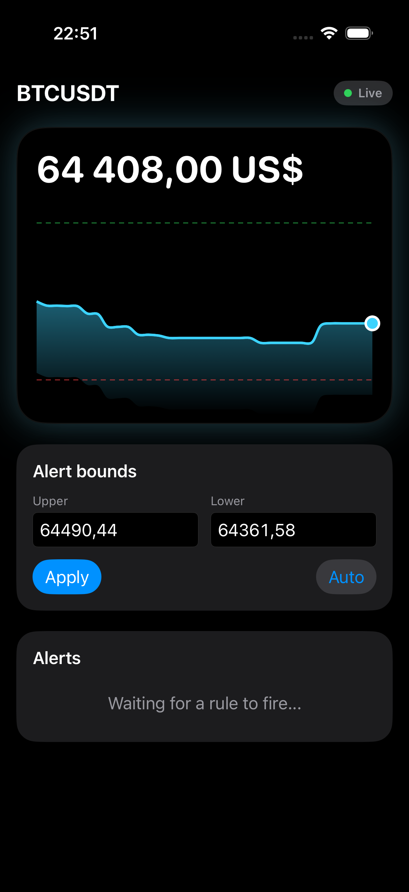
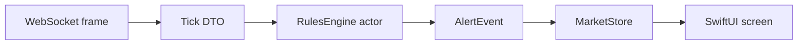

# DriftWatch

Realtime crypto price alerts over a Binance WebSocket. Set an upper and a lower
line; the app watches the live trade stream and fires the moment the price
crosses your line. No backend, no API key: it connects straight to the Binance
public market-data stream.

Diploma project for the OTUS iOS Developer Professional course. The thesis topic
is the WebSocket pipeline: a live stream, an actor that matches rules as ticks
arrive, and the concurrency care it takes to never fire a stale or duplicate
alert.

<p align="center"></p>

## What works today

- Live BTCUSDT price over the Binance combined trade stream.
- A price chart (Swift Charts) with the alert band drawn as an upper and a lower
  line, and the live price moving between them.
- An alert feed: when the price crosses a line, a row lands in the list.
- Two band modes. Auto keeps a 0.1% band and re-anchors it on each fire, so it
  alerts on every step the price drifts. Manual lets you type your own lines.
- A connection badge: connecting, live, reconnecting, offline.

## Why it exists

Most "realtime" price apps poll a REST endpoint every few seconds, so they miss
the exact tick that crosses a threshold. DriftWatch listens to the live trade
stream instead and matches rules locally as ticks arrive.

The interesting part is keeping that correct under concurrency. All live rule
state lives in a Swift `actor`, so there is no data race by construction. The one
place that awaits is the REST resync after a reconnect, and that is where an
actor can be re-entered: a live tick can land while the resync is in flight. The
engine guards it with a per-symbol reconnect epoch and a live-tick flag, so a
live price always wins over a stale resync and a rule fires exactly once.

## How it works



Plain text: WebSocket frame to Tick to RulesEngine (actor) to AlertEvent to the
MainActor store to the SwiftUI screen.

- Prices arrive over the Binance combined trade stream as JSON frames.
- A `Tick` (a Sendable struct with a `Decimal` price) crosses into the actor.
- The actor matches every armed rule. The hot path is synchronous, so it cannot
  be re-entered. Only the post-reconnect resync awaits, and that path is guarded.
- Fired alerts and the latest price flow to the `@MainActor @Observable` store,
  and the screen reads it.

## Stack

- iOS 18, Swift 6 with strict concurrency (`complete`)
- SwiftUI with an `@Observable` store (MV, no view models)
- Swift Concurrency: actors, `AsyncStream`, structured concurrency, `[weak self]`
- Swift Charts for the price chart
- Swift Package Manager: the domain is a local package, split from the app
- Swift Testing for unit tests

## Run it

Requires Xcode 26 or newer.

```
git clone <repo-url>
cd DriftWatch
open DriftWatch.xcodeproj
```

Pick an iPhone simulator and run. No API key or account: it connects to the
public Binance stream out of the box. To run the domain tests:

```
cd DriftWatchKit
swift test
```

## Architecture

The domain logic lives in a local Swift package (`DriftWatchKit`) so the compiler
enforces the layer boundary: the domain cannot import SwiftUI or networking
because it does not depend on them. The market data source sits behind a
`PriceSource` protocol with two conformers, a live Binance one and a fake one
that replays scripted ticks for tests and the SwiftUI preview.

The app layer is a single `@MainActor @Observable` store (`MarketStore`). It runs
the source, feeds ticks to the engine, keeps a short price history for the chart,
and exposes the band bounds the screen draws.

## Reliability

The live source reconnects on its own. `connect()` runs a loop: open the socket,
read frames until the stream drops, then wait a backoff delay and reopen. It stops
only when the consumer cancels.

The delay uses capped exponential backoff with full jitter, the AWS approach. The
ceiling doubles each attempt from 0.5s up to a 30s cap, and the real delay is a
random point between zero and that ceiling. The jitter matters: without it, many
clients that dropped at the same time would all retry at the same instant and hit
the server in lockstep. `Backoff` is a small value type with unit tests for the
schedule and the range.

The attempt counter resets to zero only on the first real tick, not when the
socket opens. A socket can open and die a second later, so resetting on a live
tick keeps a short-lived connection from wiping the schedule. The status the UI
reads follows the same path: connecting on the first try, reconnecting while
retrying, live once a tick arrives.

The wait runs on an injected `Clock`. The app passes the real `ContinuousClock`; a
test can pass a clock that sleeps instantly, so the reconnect logic stays testable
without real delays.

This already handles the common cases. Any read error ends the loop body and
triggers a backoff and retry, including the 24-hour server cut and the
`serverShutdown` notice Binance sends before a planned close.

Scoped, not built yet:

- A ping/pong watchdog for a half-open socket, where `receive()` blocks with no
  error because the connection is dead but the OS has not noticed. Send a ping
  every 20s and treat a missing pong as a drop.
- Explicit close-code handling, so a close we started does not trigger a retry.
  Today cancellation already stops the loop, which covers the app-initiated case.

## Tests

`swift test` runs 30 tests with Swift Testing. They cover rule matching for each
comparator, the armed-to-triggered transition, the reentrancy case (a live tick
during the REST resync await must win, so the rule fires once and the stale resync
is dropped), and the backoff schedule with its jitter range. The fake source
injects reconnects and scripted prices, so the tests stay deterministic with no
network.

## Roadmap

- [x] Reconnect loop with full-jitter backoff (0.5-30s cap)
- [ ] Ping/pong watchdog and close-code handling for a half-open socket
- [ ] SwiftData feed: store fired alerts with dedup and keyset paging
- [ ] On-device anomaly detector (rolling z-score)
- [ ] CI: GitHub Actions for build, `swift test`, and `swift format` lint

## License

MIT. See [LICENSE](LICENSE).
